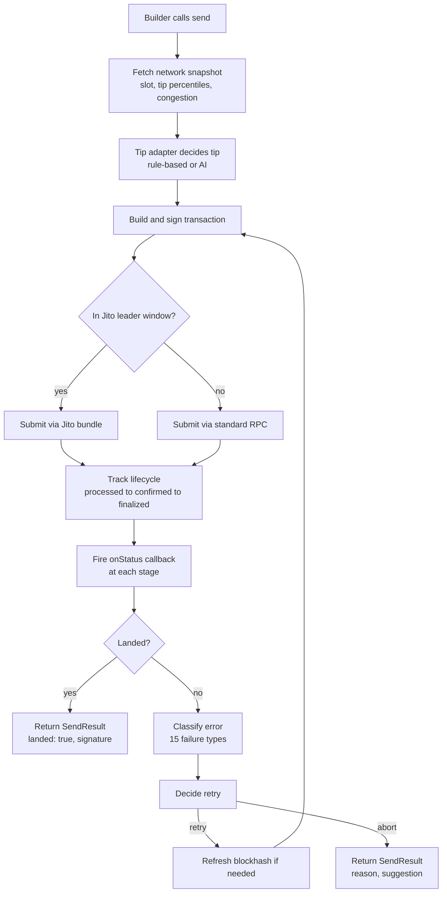

<div align="center">

# solana-smart-tx

Smart Solana transactions for builders who need payments to actually land.

[](https://www.npmjs.com/package/solana-smart-tx)
[](./LICENSE)
[](https://www.typescriptlang.org/)
[](https://solana.com/)
[](https://nodejs.org/)
[](https://github.com/Focus1010/solana-smart-tx/actions)

</div>

## The problem

You build a payment bot, wire up `sendTransaction`, and it works on devnet. Then real users start sending money and the transactions just vanish. No error, no receipt, nothing. Your user paid and the recipient never got it, so now they do not trust your product. When you do get an error, it reads `Transaction simulation failed: custom program error 0x1` at 2am and you have no idea whether the problem is your code, the network, or a low priority fee. Basic `sendTransaction` gives you no retry logic, no way to tell a dropped transaction from a slow one, and no plain language explanation of what went wrong. You end up writing the same fragile retry loop in every project and it still drops payments under load.

## What this package does

solana-smart-tx wraps a production transaction stack into one class. You give it a built transaction and it decides the tip based on live network congestion, submits through Jito or standard RPC, tracks the transaction through every lifecycle stage, and on failure it tells you exactly what happened in plain English and whether it is safe to retry. It does all of this with the default rule-based engine, which needs no AI and no extra API keys.

| What happens without this | What happens with this |
| --- | --- |
| Transactions drop silently under load | Automatic retry with fresh blockhash or a raised tip, based on the actual failure |
| `custom program error 0x1` with no context | 15 typed failure classes, each with a plain English reason and a next step |
| You guess the priority fee | Tip chosen from live Jito tip-floor percentiles scaled to congestion |
| No idea if a transaction landed | Lifecycle callbacks at submitted, processed, confirmed, and finalized |
| Hand-rolled retry loop in every project | One `send()` call that returns a typed `SendResult` and never throws |

## How it works



## Install

```bash
npm install solana-smart-tx
```

`@solana/web3.js` is a peer dependency, so install it alongside if your project does not already have it:

```bash
npm install @solana/web3.js
```

## Quick start

```ts
import { Keypair, SystemProgram, Transaction, LAMPORTS_PER_SOL } from '@solana/web3.js';
import bs58 from 'bs58';
import { SmartTx } from 'solana-smart-tx';

// Helius free tier works fine here. Swap in your own key.
const rpcUrl = 'https://mainnet.helius-rpc.com/?api-key=YOUR_KEY';
const wallet = Keypair.fromSecretKey(bs58.decode(process.env.WALLET_PRIVATE_KEY!)); // your signing keypair

const smart = new SmartTx({ rpcUrl, wallet });         // rule-based mode by default, no API keys needed

const transaction = new Transaction().add(              // build any transaction you like
  SystemProgram.transfer({
    fromPubkey: wallet.publicKey,                        // paying from the bot wallet
    toPubkey: wallet.publicKey,                          // self-transfer for this demo
    lamports: 0.01 * LAMPORTS_PER_SOL,                   // amount to move
  }),
);

const result = await smart.send({                        // send() handles tip, submit, retry, tracking
  transaction,                                           // the transaction you built above
  onStatus: (u) => console.log(u.stage, u.message),      // called at each lifecycle stage
});

if (result.landed) console.log('Landed:', result.signature); // success path
else console.error(result.reason, result.suggestion);        // failure path, always populated

await smart.disconnect();                                // release resources on exit
```

Success output:

```text
submitted  Submitted via standard RPC with a 12000 lamport priority tip.
processed  Transaction was processed by a validator (not yet confirmed).
confirmed  Transaction is confirmed by a supermajority of the cluster.
Landed: 5Nf...oR8
```

Failure output:

```text
submitted  Submitted via standard RPC with a 12000 lamport priority tip.
failed     Blockhash expired before the transaction landed. Retry with a fresh blockhash. Tip does not need to change.
retrying   EXPIRED_BLOCKHASH: refreshing the blockhash and retrying with the same tip after 800ms. Waiting 800ms before attempt 2.
submitted  Submitted via standard RPC with a 12000 lamport priority tip.
confirmed  Transaction is confirmed by a supermajority of the cluster.
Landed: 5Nf...oR8
```

## The onStatus callback

`onStatus` fires once per lifecycle stage. Each call receives a `StatusUpdate`:

```json
{
  "stage": "confirmed",
  "message": "Transaction is confirmed by a supermajority of the cluster.",
  "signature": "5Nf...oR8",
  "slot": 285000123,
  "timestamp": 1752940800000,
  "retryCount": 0
}
```

Here is when each stage fires and what it means in plain language:

- `submitted`: the transaction has been signed and sent to the network. It has a signature now, but it has not landed. This is not a receipt.
- `processed`: a validator has run the transaction. It is on-chain but could still be dropped by a fork. Treat it as "probably fine, not final."
- `confirmed`: a supermajority of the cluster has voted on the block. For most payment apps this is the point where you can safely tell your user the money moved.
- `finalized`: the block is old enough that it can never be rolled back. Use this for high-value transfers where you want zero reversal risk.
- `failed`: the attempt did not land. The message contains the plain English reason and the suggestion. A retry may follow.
- `retrying`: the send loop is about to try again. The message says why, how long it will wait, and which attempt is next.

You never have to poll. If you only care about one stage, check `update.stage` inside the callback and ignore the rest.

## Understanding failure results

When `landed` is false, `SendResult` carries a typed `failureType`, a `reason`, and a `suggestion`. Here is every failure type:

| Type | What it means | What to do |
| --- | --- | --- |
| `EXPIRED_BLOCKHASH` | The transaction took too long and its blockhash aged out before it landed. | Retry with a fresh blockhash. The package does this for you. Tip does not need to change. |
| `BLOCKHASH_NOT_FOUND` | The blockhash was never seen by validators, usually a lagging RPC. | Fetch a new blockhash from your main RPC and retry. |
| `INSUFFICIENT_FUNDS` | The wallet does not hold enough SOL for the transfer plus fees. | Top up the wallet with SOL, then retry. Do not retry before topping up. |
| `INSTRUCTION_ERROR` | A program rejected one of your instructions on-chain. | Do not retry. Check your program logic and the accounts you passed in. |
| `SIMULATION_FAILED` | The transaction was rejected during the preflight dry run. | Do not retry. Fix the transaction first. |
| `BUNDLE_DROPPED` | Your Jito bundle was accepted but never landed, usually the tip was too low. | Retry with a higher tip in the next leader window. The package raises the tip for you. |
| `BUNDLE_REJECTED` | The Jito block engine rejected the bundle outright. | Check your bundle structure and tip account before retrying. |
| `LEADER_NOT_AVAILABLE` | No Jito leader is scheduled right now, so a bundle cannot be included. | Wait for the next leader window and retry. |
| `RATE_LIMITED` | Your RPC or the block engine is throttling you. | Wait a few seconds and retry with backoff. The package backs off automatically. |
| `ACCOUNT_NOT_FOUND` | An account your transaction needs does not exist on-chain. | Do not retry. Verify every address, and create token accounts if missing. |
| `COMPUTE_BUDGET_EXCEEDED` | The transaction used more compute than it asked for. | Raise the compute unit limit in your transaction, then retry. |
| `DUPLICATE_TRANSACTION` | This exact transaction already landed. | Do not retry. It is already on-chain. Look up the signature. |
| `NETWORK_CONGESTION` | The network is busy and dropped the transaction under load. | Retry with a higher tip. The package raises the tip for you. |
| `RPC_TIMEOUT` | Your RPC did not answer in time, so the outcome is unknown. | Switch to a backup RPC endpoint and retry. |
| `UNKNOWN` | The error did not match any known pattern. | Read the raw error, retry once, and abort if it fails again. |

## Configuration reference

Every option on `SmartTxConfig`:

### Core

| Field | Type | Required | Default | Description |
| --- | --- | --- | --- | --- |
| `rpcUrl` | `string` | Yes | none | Helius or any Solana RPC endpoint. |
| `wallet` | `Keypair` | Yes | none | The keypair used to sign transactions. |
| `network` | `'mainnet-beta' \| 'devnet'` | No | `mainnet-beta` | Target network. Bundles are only used on mainnet. |
| `mode` | `'rule-based' \| 'ai'` | No | `rule-based` | Decision engine. Rule-based needs no API keys. |
| `jitoRpcUrl` | `string` | No | Jito mainnet block engine | Override the Jito endpoint. |

### Tip

| Field | Type | Required | Default | Description |
| --- | --- | --- | --- | --- |
| `tipConfig.minLamports` | `number` | No | `1000` | Floor for any tip. |
| `tipConfig.maxLamports` | `number` | No | `1000000` | Ceiling for any tip. |
| `tipConfig.defaultPercentile` | `'p25' \| 'p50' \| 'p75' \| 'p95'` | No | `p50` | Tip-floor percentile to target. |

### Retry

| Field | Type | Required | Default | Description |
| --- | --- | --- | --- | --- |
| `retryConfig.maxRetries` | `number` | No | `3` | Maximum retries before giving up. |
| `retryConfig.baseWaitMs` | `number` | No | `800` | Base wait between retries. |
| `retryConfig.maxWaitMs` | `number` | No | `10000` | Cap on exponential backoff. |

### Yellowstone (Advanced)

| Field | Type | Required | Default | Description |
| --- | --- | --- | --- | --- |
| `yellowstoneEndpoint` | `string` | No | none | gRPC endpoint for slot streaming. Faster and more accurate lifecycle tracking. |
| `yellowstoneToken` | `string` | No | none | Auth token for the Yellowstone endpoint. |

### AI (Advanced)

| Field | Type | Required | Default | Description |
| --- | --- | --- | --- | --- |
| `aiConfig.provider` | `'groq' \| 'anthropic'` | Only if `mode` is `ai` | none | LLM provider for AI decisions. |
| `aiConfig.apiKey` | `string` | Only if `mode` is `ai` | none | API key for the chosen provider. |
| `aiConfig.model` | `string` | No | `llama-3.3-70b-versatile` (Groq) | Model name. |

## The Telegram bot pattern

Most Nigerian builders ship on Telegram first. It is where the users already are, it needs no app store review, and a bot can go live in an afternoon. That makes Telegram the natural front end for payment bots, remittance tools, and P2P stablecoin apps. Here is the core of the `/send` handler from the full example:

```ts
bot.command('send', async (ctx) => {
  const [, amount, recipient] = ctx.message.text.split(/\s+/);
  const toAta = await getAssociatedTokenAddress(USDC_MINT, new PublicKey(recipient));
  const fromAta = await getOrCreateAssociatedTokenAccount(connection, wallet, USDC_MINT, wallet.publicKey);
  const transaction = new Transaction().add(
    createTransferInstruction(fromAta.address, toAta, wallet.publicKey, BigInt(Number(amount) * 1e6)),
  );
  const result = await smart.send({
    transaction,
    onStatus: (u) => ctx.reply(`[${u.stage}] ${u.message}`),  // stream progress to the chat
  });
  await ctx.reply(result.landed ? `Sent. ${result.signature}` : `Failed: ${result.suggestion}`);
});
```

Full working file: [examples/telegram-bot.ts](examples/telegram-bot.ts).

## Cost breakdown

The default rule-based mode runs entirely on free tiers. Nothing here requires a paid plan to ship.

| Component | Provider | Free tier | Paid tier |
| --- | --- | --- | --- |
| RPC | Helius | 1M credits/month, enough for a small bot | From about 49 USD/month for higher throughput |
| Jito submission | Jito block engine | Free, no key required | Free |
| Tip data API | Jito tip floor API | Free, no key required | Free |
| AI mode | Groq | Generous free tier on Llama models | Pay per token above the free tier |
| Slot streaming | Yellowstone gRPC | Included on Helius paid plans | Included on Helius paid plans |

## Roadmap

- [x] Core `send()` with rule-based adapter (current)
- [ ] AI adapter (Groq and Anthropic) - August 2026
- [ ] Remittance bot reference implementation (full open-source bot) - August 2026
- [ ] P2P payment request bot reference implementation - September 2026
- [ ] Yellowstone gRPC slot streaming integration - September 2026
- [ ] NPM publish and versioning - September 2026

## Contributing

Contributions are welcome. See [CONTRIBUTING.md](CONTRIBUTING.md) to get started. This package is built on top of the production transaction stack at github.com/Focus1010/solana-smart-tx-stack.

Nigerian builders are the primary target audience for this package. Contributions that improve the experience for low-bandwidth and mobile-first environments, such as smaller payloads, better offline handling, and clearer error messages, are especially welcome.

## License

MIT
